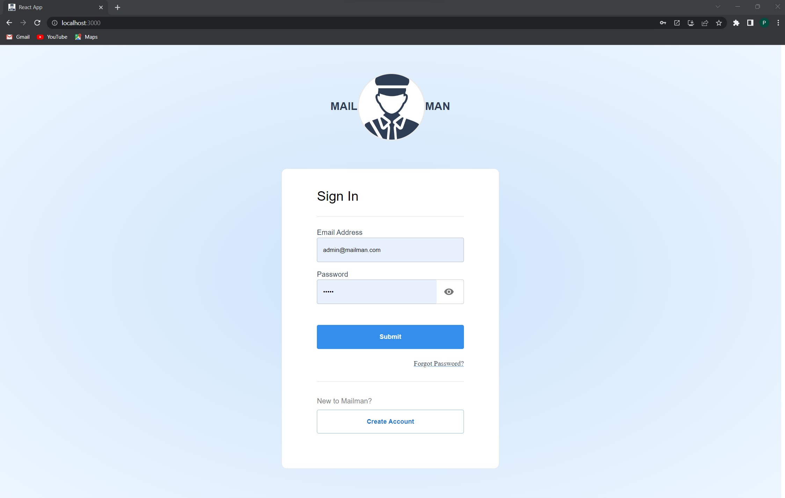
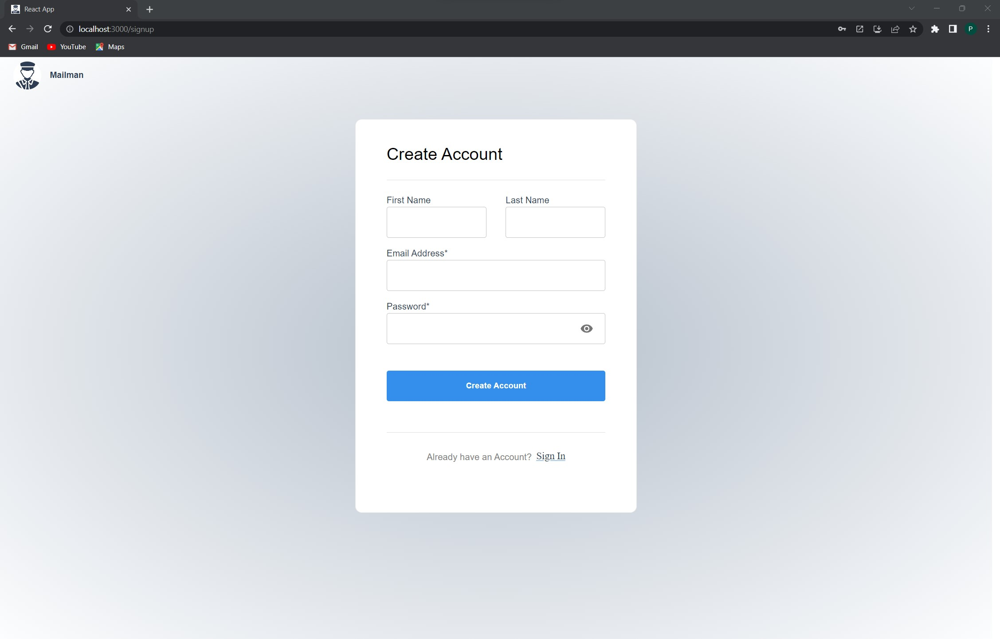
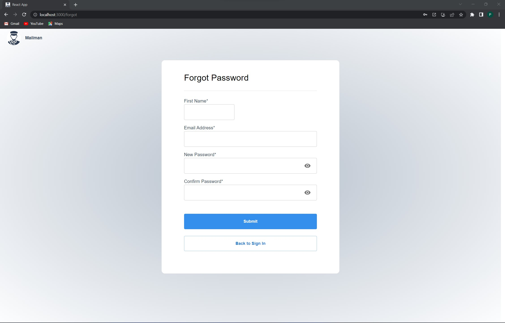
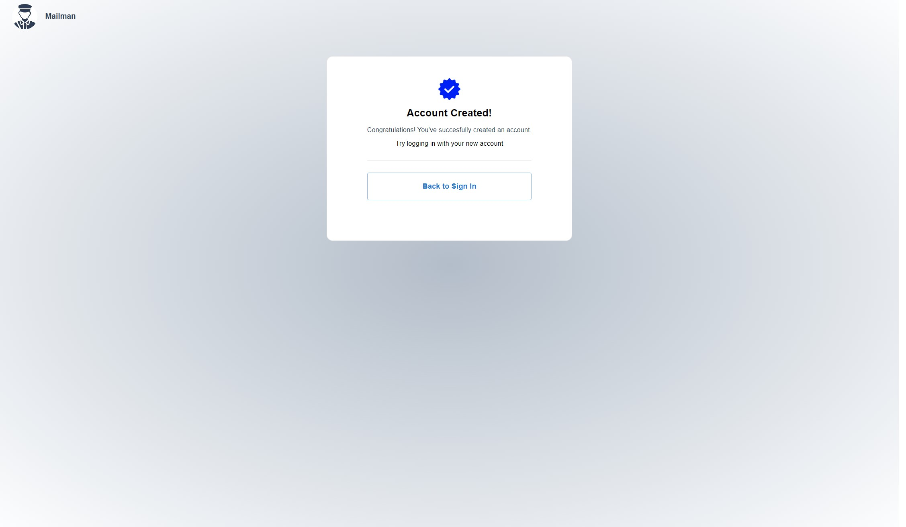
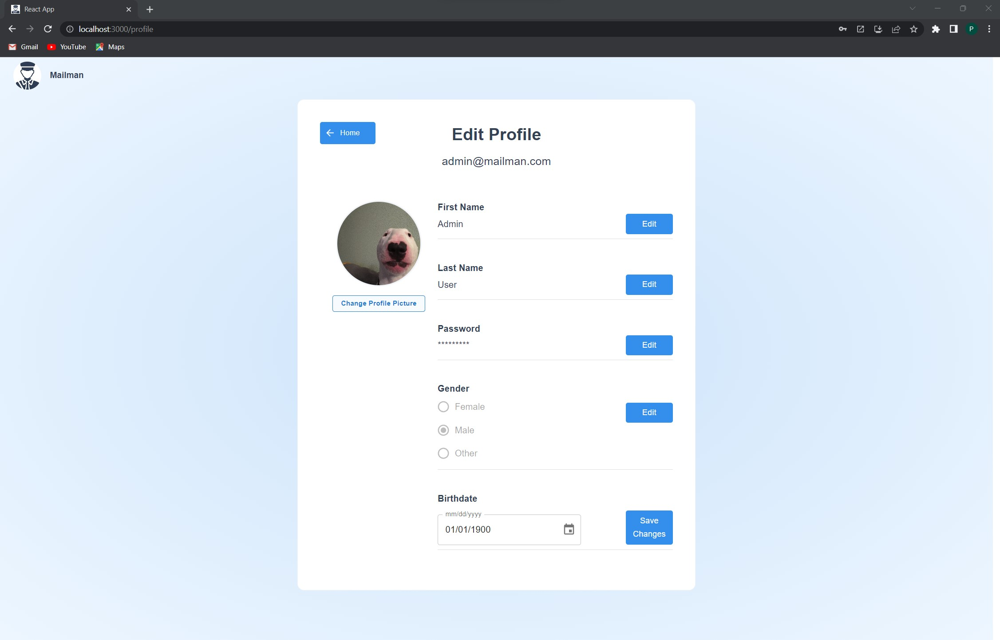

# MailMan
- A solo project of mine that im currently working on.  It is an email service like yahoomail or gmail, where a user can create an account and send/recieve emails with another user.
***************
# Frontend  
- React  
- Javascript 
- MUI + CSS 
***************
# Backend  
- Node Express
- MongoDB
- JWT + bcrypt (Authentication)  
****************
# Screenshots  
(mainpage excluded) 
**Signin**

    
**Signup**

    
 **Forgot Password**

    
 **Account Creation Successful**

    
 **Edit Profile**

    

